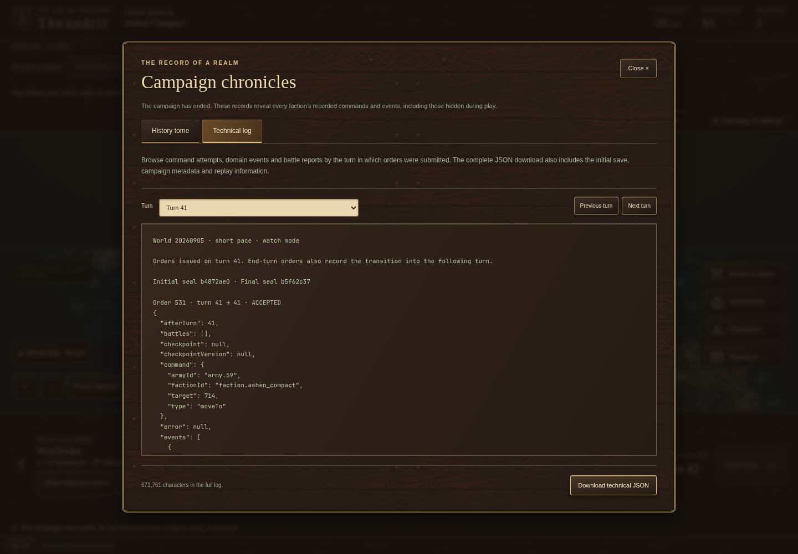
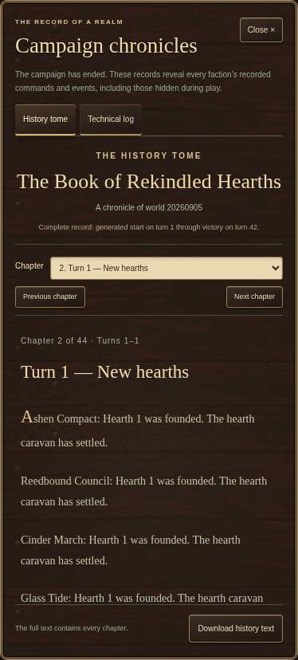
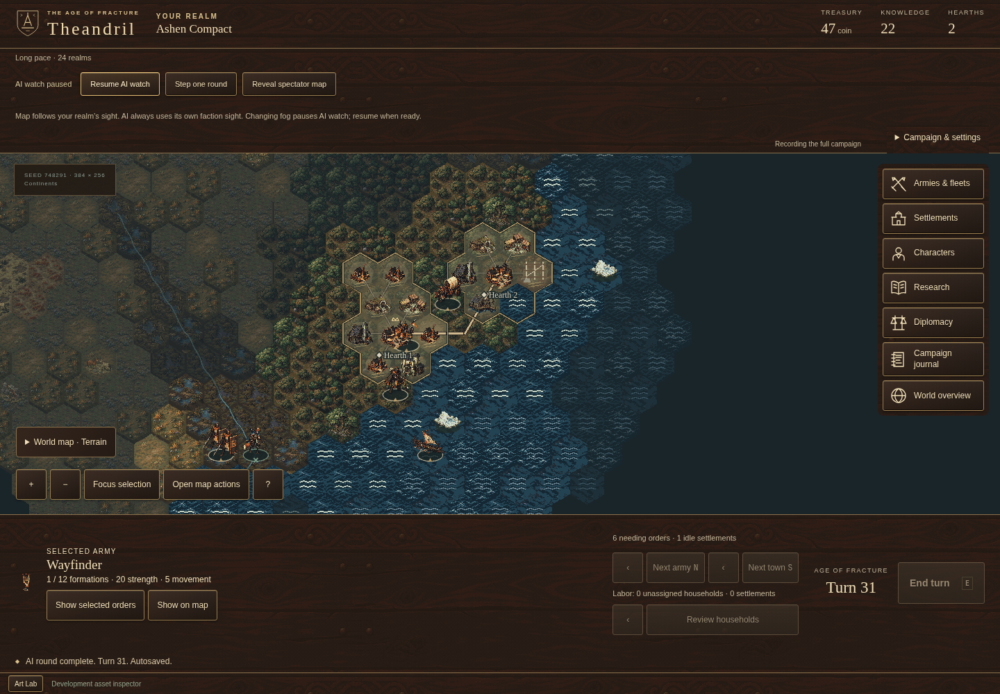
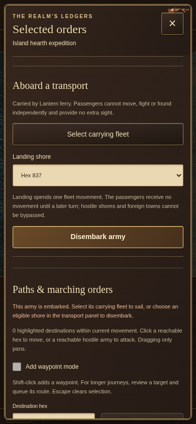
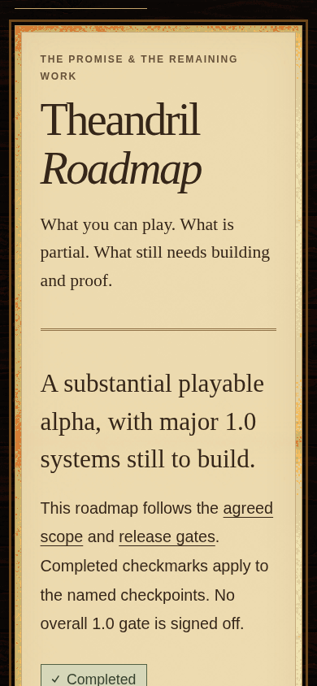

# A funded expedition and a practical route to 1.0

## Identity

- Stable entry slug: `campaign-foundation-and-development-order`.
- Publication state: **reviewed and authorized for the development catalogue**; push and live readback pending. The public dispatch pins implementation checkpoint `1e41ec24965e46e8035c57b4f54632a690b8b712`.
- Started: 2026-09-21.
- Base revision: `f07024fe23ad3386874656d48fbbc33a5380d979`. The [roadmap-start checkpoint](../development/2026-09-21-roadmap-start/source-manifest.json), [historical continuation](../development/2026-09-21-campaign-continuation/source-manifest.json) and [Epic baseline pass](../development/2026-09-21-epic-baseline/runner/source-manifest.json) retain their separate working-source manifests. Their reviewed final implementation is now committed in `1e41ec24965e46e8035c57b4f54632a690b8b712`.
- Current campaign/save rules: **17**; content hash **`b79c78ed`**. No schema or content change.
- Categories: AI, campaign verification, contributor roadmap.

## The player's problem

An isolated realm could fund an unnecessary third harbor while its second was still being built. Its naval planner also repeatedly indexed the same explored geography as more founders waited near a harbor. Both findings now have locally implemented, independently reviewed corrections. Long-campaign verification remains an open acceptance condition.

Earlier continuation work reduced the work needed to publish explored land, prepare a fleet's destination preview, order save data and format the campaign record. The current pass avoids further temporary pathfinding storage and delays naval preparation until a plan uses it. The same information and decisions remain available. The latest unchanged default full suite still fails its Epic archive timing check: **64.779 seconds against 60**. These improvements are a local checkpoint, not acceptance of M0.

The existing roadmap names the missing systems, but development also needs a concrete order with dependencies and observable completion criteria.

## Current Epic baseline pass

- **Movement searches allocate less temporary storage.** A search-local neighbor buffer preserves the same hex order, and range searches no longer build a predecessor map they never consume. Complete routes, blockers, costs, fog behavior and shared node charging remain unchanged in 44 paired complete-query/preview comparisons. Measured query gains are modest and mixed: the movement-200 full-query median changes from 2.861 to 2.773 ms, while a smaller preview case regresses slightly. This does not establish a whole-campaign speedup. [Source](../../packages/sim/src/movement.ts), [topology regressions](../../packages/mapgen/src/neighbors-into.test.ts), [measurement and limits](../development/2026-09-21-epic-baseline/movement/README.md).
- **A naval plan prepares geography only when it needs it.** Shoreline, home-land, navigation and frontier preparation remain local to one plan and are delayed until consumed. Funding and research still run when no eligible fleet exists. Thirty-six complete plans from real retained Epic checkpoints preserve commands, reasons, held armies, queued settlements and expenditure; an additional test covers repeated calls with changed budgets and held fleets. The sum of 36 case medians changes from 36.391 to 34.730 ms, with mixed late passenger cases. This is a detached-observation benchmark, not the separate Epic archive gate. Earlier proposal captures and the authored eight-turn paid voyage still match, including all 22 accepted commands and final hash `fa29672f`. [Source](../../packages/ai/src/naval.ts), [regressions](../../packages/ai/src/naval-publication-equivalence.test.ts), [evidence and limits](../development/2026-09-21-epic-baseline/ai/README.md).

These are the only new production optimizations in this pass, with **39 new regressions**. Hash-kernel and alternate-heap candidates did not justify adoption; a primitive-validation wrapper changed rejection formatting and was rejected. Archive command reuse and a shared preview session were not introduced. [Retained investigations](../development/2026-09-21-epic-baseline/README.md#investigations-not-adopted) explain the limits. No persistent cache, activity reduction, rules/schema change or art change is included.

Default, eight-worker and four-worker full-suite diagnostics all fail the existing Epic limit. Neither worker cap is adopted, and the existing test configuration remains unchanged. Read-only [web/AI](../development/2026-09-21-epic-baseline/m1-client-plan.md) and [save/replay](../development/2026-09-21-epic-baseline/m1-save-plan.md) handoffs prepare the next interfaces; **M1 is not implemented**.

The compendium browser test also now saves its two screenshots in the current test output, preserving historical review images. The rebuilt Pages suite verifies this correction with all existing assertions intact.

## Current pass imagery

Current build, authored naval regression: after researching Ocean navigation and restoring a queued deep-ocean voyage, the passenger can select a shore and disembark through the ordinary controls. The test completes landing, verifies the same formations and saves again. This is a human-command regression at 390 × 844, not evidence of a naturally planned AI colony.

Current build, generated Short AI-watch campaign with seed 20260905 after saved continuation and victory. The 1440 × 1000 capture displays the actual technical record and complete JSON download. It does not establish Epic timing acceptance. Both current images retain exact, inspected Playwright bytes with [source paths, dimensions and hashes](../development/2026-09-21-epic-baseline/screens/provenance.json); no image generation or transformation was used.

## Previous checkpoint retained

- A second paid harbor under construction now counts toward an isolated realm's two-outlet commitment limit. Ordinary payment, blocked/queued scout funding, and an established caravan route through arrival and founding have explicit regressions. Selection and shared geography work keep the 61-cell chart at 337 reads across 1, 8, 32 and 128 waiting founders. [Source](../../packages/ai/src/naval.ts), [regressions](../../packages/ai/src/naval-outlets.test.ts), [before/after evidence](../development/2026-09-21-roadmap-start/naval/README.md).
- Movement queries skip edges that cannot improve a route. Captured results retain exact paths, costs, blockers, tie behavior and the original node budget. The generated Epic campaign still issues 22,914 commands, archives 249 battles and reaches the same final hash `1e4534db`; the retained local sample improves from 32.443 to 27.161 seconds after the naval and movement changes. This is one profiled sample per version, not a universal speedup. [Source](../../packages/sim/src/movement.ts), [query equivalence](../../packages/sim/src/movement-search-equivalence.test.ts), [metrics](../development/2026-09-21-roadmap-start/performance/README.md).
- Archive replay compares ordinary event/battle JSON trees directly, avoiding repeated full encoding while retaining complete comparisons and corruption rejection. That checkpoint left technical export formatting unchanged; the continuation below preserves its bytes through a simpler rendering path. A custom-omission issue found during review was corrected and regression-tested. A real-record comparison benchmark improves from 4.127 to 0.692 ms for 400 comparisons; this is comparison work, not complete archive throughput. [Source](../../packages/chronicle/src/json-equivalence.ts), [regressions](../../packages/chronicle/src/json-equivalence.test.ts).
- The [existing 1.0 workflow](../1.0-DEVELOPMENT.md#active-development-roadmap) now gives M0–M10 dependencies, owners, playable outcomes and acceptance. The existing public catalogue retains its stable IDs and historical source pin. Its bounded completion labels and all fifteen open gates are preserved; this draft and implementation status carry the new local results.

## Historical continuation delivered

- **Publishing a charted realm costs less while retaining its details.** Observation construction now avoids repeated temporary object copies for explored cells, worked land and improvement quotes. Ninety-one captured complete observations preserve field order, optional fields, fog memory and current/historical rules; caller edits still cannot mutate the campaign. A seventeen-town authored fixture falls from 2.031 to 1.054 ms for a complete detailed observation. A synthetic fully charted Standard map falls from 39.471 to 10.425 ms; that is publication-volume evidence, not a mature empire or frame-rate result. [Simulation](../../packages/sim/src/simulation.ts), [land observations](../../packages/sim/src/territory.ts), [evidence and limits](../development/2026-09-21-campaign-continuation/observations/README.md).
- **A save keeps the same explored cells in the same order with less sorting work.** Unordered eligible lists use native unsigned integer sorting, while already ordered and unusual inputs retain the previous behavior. The synthetic 307,200-cell case improves from 48.901 to 22.928 ms. The fast path uses additional temporary storage, approximately 3.52 MiB at that size, and retains no persistent cache. Save bytes, checksums and historical seals remain unchanged. [Source](../../packages/sim/src/canonical-cells.ts), [regressions and measurement](../development/2026-09-21-campaign-continuation/serialization/README.md).
- **The complete technical chronicle keeps its exact text without an intermediate parse and copy.** Direct sorted formatting replaces compact JSON → parse → indented JSON for the whole record and each order page. A serialization-only corpus of 16,384 repeated archive records containing real battle/event data improves from 783.868 to 576.348 ms, with identical bytes and frozen inputs. This is a synthetic long document, not a campaign throughput claim. [Source](../../packages/chronicle/src/index.ts), [renderer](../../packages/chronicle/src/json-equivalence.ts), [evidence](../development/2026-09-21-campaign-continuation/performance/README.md).
- **Fleet planning requests the destination preview it uses.** Three naval callers use a new preview API that preserves the full preliminary search and shared 4,096-node budget while omitting unused reachable-cell and attack-overlay publication. Full map/UI queries retain their complete results. Twenty-two original previews and 91 proposal/site variants agree; an authored eight-turn voyage preserves all 22 accepted commands, save mirrors and final hash `fa29672f`, including boarding, deep-water sailing, landing and founding. Representative target queries improve by 35–76%; the disconnected-fog case improves only 6.8%. [Movement source](../../packages/sim/src/movement.ts), [naval callers](../../packages/ai/src/naval.ts), [complete evidence and limits](../development/2026-09-21-campaign-continuation/movement-preview/README.md).

A broader state-hash cache was **rejected**, not shipped. It sped up unchanged hashes but made late land changes 18–45% slower, retained additional graphs and strings, and had unresolved custom JSON conversion differences. Its [measured results and rejection](../development/2026-09-21-campaign-continuation/performance/hash-investigation.md) remain available so future work can assess the tradeoff. Production continues to validate and serialize through the existing strict path.

M1 preparation captured a [genuine pre-change rules-17 save and archive](../development/2026-09-21-campaign-continuation/m1-fixture/README.md): three realms founded through recorded commands, a paid peace treaty, a pending offer and verified historical expiry continuation. Initial scout contact was authored and is disclosed. This preserves migration/replay evidence; **client contracts and unification are not implemented by this work**.

## Historical continuation imagery

Earlier continuation: a generated Short AI-watch campaign, seed 20260905, reaches victory on turn 42 after saved continuation. The technical log shows actual recorded commands and the complete export control at 1440 × 1000. This illustrates the retained export surface; it does not establish current-source verification, Epic timing acceptance or a new UI feature.

The same earlier generated campaign's history at a 390-pixel viewport, with no authored victory state. The image is the exact 374 × 828 modal capture. Both images were inspected locally; original capture paths, dimensions and hashes are retained in [historical image provenance](../development/2026-09-21-campaign-continuation/screens/provenance.json). They illustrate a journey in the earlier passing 25-scenario gameplay run below. No image was generated, cropped or re-encoded for this packet.

## Prior-checkpoint imagery

These three images belong to the previous roadmap-start checkpoint. They illustrate its actual game and review journeys; they have not been recaptioned as captures of the current Epic baseline pass. Current build/browser evidence is tracked separately below.

Prior checkpoint: actual generated Standard/Long campaign, seed 748291, paused after contact. The browser journey checks responsiveness and the contact witness; this image illustrates the campaign, not the synthetic harbor regression or a scale certification. [Contact witness](../development/2026-09-21-roadmap-start/standard-contact-witness.json).

Prior checkpoint: the actual game at 390 × 844 in the authored naval regression. A passenger remains aboard its saved transport route and can land legally. The scenario preserves the passenger formations through save/load. It is not an organically planned AI expedition.

Prior checkpoint: the production build at `/Theandril/updates/roadmap/`, 390 pixels and 130% text. The full dependency plan extends the same catalogue. Exact uncropped captures, original test paths, dimensions and hashes are retained in [image provenance](../development/2026-09-21-roadmap-start/screens/provenance.json). No new artwork was generated or approved.

## Scope ledger

This packet covers the user's authorized roadmap start and continued local development. It adds no gameplay scope and removes none of the accepted release requirements. Historical failed reviews and rejected experiments remain retained. The continuations prepare M1 compatibility evidence and interfaces but do not begin its gameplay implementation or change its dependencies. Worker-cap diagnostics did not produce an adopted scheduling change. A test-only proof-retention correction makes compendium screenshots use the current Playwright output directory instead of overwriting historical documentation captures; assertions and runtime behavior remain unchanged. No request authorizes publishing or deployment; this remains the same single draft packet and catalogue.

## Current Epic baseline verification and review

Current results are local on Node 22.23.2 at the base revision above plus the [frozen runtime/test/config manifest](../development/2026-09-21-epic-baseline/runner/source-manifest.json). The [final source manifest](../development/2026-09-21-epic-baseline/source-manifest.json) records the later compendium screenshot-output correction as the sole difference across those 614 paths; it is outside the headless suite, and runtime sources remain frozen.

| Check | Actual result |
| --- | --- |
| Final typecheck, lint, content/art validation | Pass. [Typecheck](../development/2026-09-21-epic-baseline/typecheck-final.log), [lint](../development/2026-09-21-epic-baseline/lint-final.log), [content](../development/2026-09-21-epic-baseline/content.log), [art](../development/2026-09-21-epic-baseline/art.log). Content remains `b79c78ed`. |
| Unchanged default full headless suite | **1,857/1,858 tests**, **220/221 files**, **87.84 seconds** overall. Epic takes **64.779 seconds against 60**; the run fails. [Raw log](../development/2026-09-21-epic-baseline/runner/default-b.log), [summary](../development/2026-09-21-epic-baseline/runner/default-b.summary.json). |
| Eight-worker and four-worker diagnostics | Both pass the same 1,857/1,858 tests and fail Epic, at **64.474** and **63.069 seconds** respectively. Neither cap is adopted. [Eight-worker summary](../development/2026-09-21-epic-baseline/runner/eight-a.summary.json), [four-worker summary](../development/2026-09-21-epic-baseline/runner/four-a.summary.json), [review and limits](../development/2026-09-21-epic-baseline/review/runner.md). |
| Focused movement and naval tests | [92/92 movement/topology checks](../development/2026-09-21-epic-baseline/movement/focused.log) and [60/60 naval checks](../development/2026-09-21-epic-baseline/ai/focused-final.log) pass. These overlapping checks are not added to the full-suite count. |
| Production build | Pass. [Raw log](../development/2026-09-21-epic-baseline/build.log). |
| Affected Chromium gameplay scenarios | **25/25**, 2.6 minutes. [Raw log](../development/2026-09-21-epic-baseline/browser-gameplay.log). This is scoped Chromium coverage, not complete gameplay or cross-browser certification. |
| Production Pages browser suite | **27/27**, 28.9 seconds, against the rebuilt `/Theandril/` bundle, including the corrected compendium capture paths. [Raw log](../development/2026-09-21-epic-baseline/browser-pages.log). |

Independent [movement](../development/2026-09-21-epic-baseline/review/movement.md) and [naval](../development/2026-09-21-epic-baseline/review/naval.md) reviews found no blocking issue in the bounded changes. The [runner review](../development/2026-09-21-epic-baseline/review/runner.md) supports keeping the existing configuration and rejects an acceptance claim. Its reviewer authored the diagnostic harness; that review is not a separate blind validation of the harness. [Current evidence index](../development/2026-09-21-epic-baseline/README.md).

The [final independent factual and visual review](../development/2026-09-21-epic-baseline/review/final.md) verifies the final source manifest, current image pixels/provenance and retained check results, finding no blocking issue within this local checkpoint. It does not clear the Epic failure or authorize publication.

No test timeout, assertion, activity requirement, historical seal or rendering budget was relaxed. The isolated pre-change profile passed Epic in 52.46 seconds; it does not supersede the failed default full run. No hosted CI or release acceptance is claimed. **M0 and all fifteen whole release gates remain open.**

## Historical continuation verification and review

These earlier results are local on Node 22.23.2 at base revision `f07024fe23ad3386874656d48fbbc33a5380d979` plus the [historical continuation working-source hashes](../development/2026-09-21-campaign-continuation/source-manifest.json).

| Check | Actual result |
| --- | --- |
| Typecheck, lint, content/art validation | Pass. [Typecheck](../development/2026-09-21-campaign-continuation/typecheck-final.log), [lint](../development/2026-09-21-campaign-continuation/lint-final.log), [content](../development/2026-09-21-campaign-continuation/content.log), [art](../development/2026-09-21-campaign-continuation/art.log). Content remains `b79c78ed`. |
| Final unchanged full headless suite | **1,818/1,819**, 218/219 files, 90.01 seconds overall. Epic takes **64.312 seconds against 60**; the run fails. [Raw log](../development/2026-09-21-campaign-continuation/full-headless-final.log). |
| Intermediate isolated Epic diagnostic | Pass in 50.45 seconds before the final movement-preview change. This does not close the default parallel or hosted gate. [Log](../development/2026-09-21-campaign-continuation/performance/epic-before-hash.log). |
| Earlier continuation production build | Pass; existing bundle-size warning remains. [Raw log](../development/2026-09-21-campaign-continuation/build.log). |
| Earlier continuation affected Chromium gameplay scenarios | **25/25**, 2.5 minutes: land, movement, naval, diplomacy, contact, defense and chronicles. [Raw log](../development/2026-09-21-campaign-continuation/browser-gameplay.log). |
| Earlier continuation production Pages browser suite | **27/27**, 33.2 seconds, using its rebuilt `/Theandril/` bundle. [Raw log](../development/2026-09-21-campaign-continuation/browser-pages.log). |

[Historical continuation commands and evidence](../development/2026-09-21-campaign-continuation/README.md). Targeted regressions overlap that full suite and are not added to its count. Sandbox/environment attempts are retained separately from product results. Test timeouts, assertions, scheduling, simulation schemas, historical seals and rendering budgets were not relaxed. No new hosted CI result is claimed.

The [previous checkpoint](../development/2026-09-21-roadmap-start/README.md) separately passed typecheck/lint/content/art/build, 20/20 affected Chromium scenarios and 27/27 production Pages checks. Its full headless run failed at 1,768/1,769 tests, with Epic at 66.351 seconds; its isolated diagnostic passed in 52.03 seconds. Those historical results are retained, not carried forward as verification of the current source.

Independent [naval](../development/2026-09-21-roadmap-start/review/naval.md), [movement](../development/2026-09-21-roadmap-start/review/movement.md), [replay](../development/2026-09-21-roadmap-start/review/chronicle.md), and [roadmap](../development/2026-09-21-roadmap-start/review/roadmap.md) reviews approve their bounded changes. Their approvals do not override the full-suite failure.

The historical continuation has independent [explored-cell](../development/2026-09-21-campaign-continuation/review/canonical-cells.md), [observation](../development/2026-09-21-campaign-continuation/review/observations.md), [formatting](../development/2026-09-21-campaign-continuation/review/pretty-json.md) and [movement-preview](../development/2026-09-21-campaign-continuation/review/movement-preview.md) reviews. The [cache review](../development/2026-09-21-campaign-continuation/review/hash-prototype-notes.md) explains why that prototype remains outside production. Its [final factual/visual review](../development/2026-09-21-campaign-continuation/review/final.md) approves only that earlier checkpoint's claims, source/log hashes and imagery; it does not review the current pass, clear the Epic timeout or authorize publication.

The prior [final factual/visual review](../development/2026-09-21-roadmap-start/review/final.md) approves only that earlier checkpoint's claims and imagery. Publication remains unauthorized.

## Road to 1.0

The foundation work advances Gates A and C, with save/replay compatibility checked against E and military behavior against F. **M0 remains in progress and all fifteen whole release gates remain open.** Next, resolve actual runtime cost behind the unchanged default-suite Epic timing failure without reducing activity or verification. Rejected cache/hash/heap experiments and unsuccessful worker-cap diagnostics narrow the investigation without removing the acceptance requirement. Then implement M1 client-state diplomacy and a distinct, contestable unification victory, using the genuine v17 fixture and interface handoffs for compatibility. M2's magical-site/caster/counterplay loop and M3's empire delegation follow the [existing dependencies](../1.0-DEVELOPMENT.md#active-development-roadmap). Current ownership is in `packages/ai`, `packages/sim`, `packages/mapgen`, `packages/chronicle` and the existing campaign tests; diplomacy rules must remain in `packages/sim`.

## Publication

The subsequent September 21 request to reconcile and deploy Theandril explicitly authorizes publication. Earlier no-publication statements in this packet describe its original local-development scope. The public entry uses the same slug, the committed implementation checkpoint and the exact two reviewed screenshots; it preserves all fifteen open gates and the failed Epic acceptance result. Its historical checkpoint measurements are not relabelled as fresh release results.

Fresh release-candidate verification passes typecheck, lint, content/art validation, build and **27/27 production Pages checks**. The unchanged headless suite remains **1,858/1,859**, with Epic at **66.513 seconds against 60**. [Release evidence](../development/2026-09-21-release-reconciliation/README.md) and [independent publication review](../development/2026-09-21-release-reconciliation/journal-review.md) separate this publication work from gameplay and whole-release acceptance. Push and live deployment readback remain pending at this preparation checkpoint.
