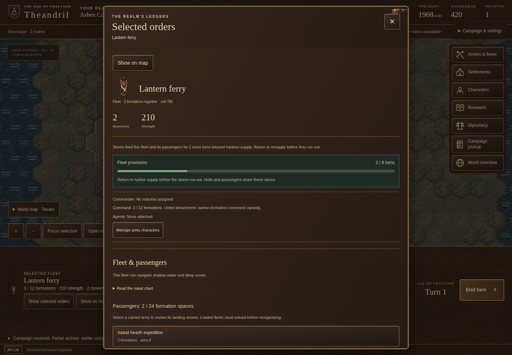
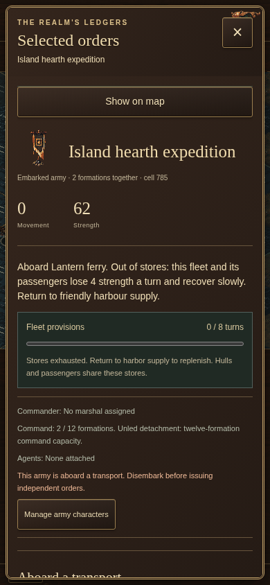

# A voyage needs stores for the way home

## Identity

- Stable entry slug: `fleet-provisions`.
- Publication state: **published and live-verified at `36fea99729452651c09cc7d5ddae81bb1dca4db2`**.
- Implementation source: **`b623c2c91d4d852cba710f2d996c28a6b1b5d624`**.
  The user explicitly authorized deployment and continued development after the
  local implementation and independent reviews were complete. The retained local
  evidence records describe their original pre-publication boundary; this packet
  records the later publication preparation without rewriting those records.
- Public edition: **05**, title **A voyage needs stores for the way home**.
- Campaign/save version: **31**. Content: **`015468d1`**, unchanged pace prices.
- Existing work: DHARMA **ACT-35**, within **M4 / ACT-33**.

## The player's problem

A harbour could feed nearby water, but a fleet never needed that food. It could
stay across an ocean forever with its passengers. The first attempt to give
fleets provisions also exposed a planning failure: AI ships sailed away without
allowing for their return, and the headline Epic campaign slipped beyond its
target duration.

## The playable change

A fleet now carries eight turns of stores outside its realm's supply. The last
ration still feeds everyone aboard. After that, hulls and passengers lose
strength and recover slowly until the fleet returns to friendly harbour supply.
The selected-force panel shows the remaining turns and whether the current
position can replenish them. Splitting or merging hulls cannot refill stores.

The AI plans a return using charted, permitted water and the actual movement
quotes. It waits for stores on returning, can finish an immediately safe landing,
and pays for a harbour at an owned coastal foothold near a depleted expedition.
The same commands and costs govern both sides. Review caught and corrected a
coastal galley choosing nearby deep-water supply instead of reachable shallows.

**Authored browser scenario:** an imported expedition moves through the normal
controls and saves offshore with two turns of stores. This is a regression
fixture with funded ships and an explicit starting store count, not an earned
AI invasion.

**Same scenario at 390 pixels:** after the last ration, a further end turn costs
four strength to each hull and passenger formation. The journey then sails into
harbour reach, replenishes stores and saves again. These are original inspected
Playwright captures, with no generated pixels or image transformations.

## Engineering and evidence

The simulation owns endurance, attrition, recovery and reorganization. The UI
receives only its realm's supply read model; foreign stores remain private. A
separate carrier pass prevents passenger ID ordering from changing when the
last ration runs out. The existing supply phase precedes queued movement, so a
queued arrival refills on the following supply phase.

Six genuine rules30 saves and archives were captured before changing defaults.
Their original bytes, hashes and command replay remain exact. A modern
continuation acquires stores without rewriting old records, and the mixed
history survives local storage and compressed export/import. Frozen envelopes
reject the new state instead of silently dropping it.

See the [verification and performance record](../development/2026-09-23-fleet-provisions/README.md),
[independent review](../development/2026-09-23-fleet-provisions/code-review.md),
and [architecture decision](../architecture/0038-fleet-provisions.md).
Pacing evidence distinguishes the twelve-realm headline campaigns from tiny
proxies; benchmark evidence separates authored throughput from generated play.
At the implementation checkpoint, **1,861 headless tests across 232 files** and
**nine affected Chromium journeys** pass. The final twelve-realm headline ends
at **234 / 342 / 379 turns** for Standard / Long / Epic. Epic is inside its band
for this measured seed; Standard and Long remain above their approximate targets.
The generated island sample retains one fleet and one passenger attrition turn,
rather than claiming loss-free planning. No pace price or proxy threshold changed.

## Scope ledger and road to 1.0

This implements part of the already accepted supply and sustained naval
operations scope. It adds no new release obligation and makes no scope cut.
It advances Gates B, C, E, F, I and K without completing any whole release gate.

Material supply costs, paid trade routes, taxation, treaty access, escorts,
coordinated reinforcement and broad disrupted-port recovery remain M4 work.
Return planning is bounded and depends on known reachable supply; this change
does not prove every invasion, basin or lost-port recovery case. All fifteen
release gates remain open.

## Publication handoff

The prepared structured dispatch pins implementation evidence and all three
unchanged screenshots to `b623c2c91d4d852cba710f2d996c28a6b1b5d624`. Its source
notes distinguish authored player controls, generated play, synthetic timing and
headline pacing. The previous four dispatch objects and their historical source
pins remain unchanged.

The current reference ledger and roadmap now use that rules31 snapshot.
`supply-and-trade` is **In progress**, with land/depot/harbor supply and finite
fleet stores delivered; material costs, trade, taxation, treaty access and broad
operation proof remain open. `military-depth` retains its partial status and
states the bounded staging and return behavior. Relevant current entries also
recognize existing charters/postings, current test results and the explicit
Standard/Long pacing gap. No whole gate becomes complete.

The three public PNGs are exact copies of the reviewed desktop and narrow
captures. `apps/web/src/updates/media.json` and the downloadable public provenance
record retain their original source paths, source revision, byte counts, SHA256
values, viewport dimensions and authored-scenario captions. The journal imagery
total is **2,156,459 bytes**, below its existing three MiB budget. Narrow figures
reuse the journal's existing 390px display constraint.

Publication preparation passes **21 focused checks across five files**:
`content.test.ts`, `media.test.ts`, `roadmap.test.ts`, `validation.test.ts` and
`journal.test.ts`. The immutable-evidence checks required a rerun outside the
sandbox because it blocked the `git cat-file` subprocess; the unrestricted run
passes. Scoped ESLint and whitespace checks pass. A direct comparison also
confirms that all four historical dispatches are byte-unchanged and all three
new public PNGs equal their reviewed source bytes.

Final parent review must check the new article and current ledger against the
pinned evidence, run the built Pages-subpath journeys, inspect the displayed
figures and then verify the authorized publication at its actual Git revision
and public URLs. Publication and deployment remain separate from 1.0 acceptance.

## Publication result

Published with the game at `36fea99729452651c09cc7d5ddae81bb1dca4db2`. Build and Pages Actions passed. Final local checks pass 1,878 headless tests, seven affected development journeys and 28 production Pages journeys; the same 28 production journeys pass against the public site. Exact article routes, release ledger and group screenshot bytes were read back. [Deployment evidence](../development/2026-09-23-deploy-and-group-postings/deployment.json). Earlier preparation and pinned implementation counts above remain historical evidence. No release gate is accepted by publication.
